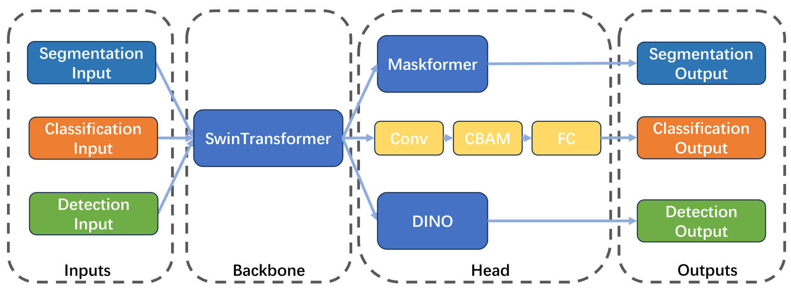

### （1）完整算法结构框图、思路步骤详述、代码组织结构介绍；
算法结构框图如图所示:



以SwinTransformer作为Backbone，以Maskformer作为分割头、DINO作为检测头、Conv+CBAM+FC作为分类头。

考虑模型的泛化性、推理速度，采用SwinTransformer-Small作为主干。


### （2）数据增强/清洗策略；

#### 1）分割数据增强
```
# 多尺度缩放
L(ResizeStepScaling)(min_scale_factor=0.5, 
                    max_scale_factor=2.0, 
                    scale_step_size=0.05), 
# 随机裁剪
L(RandomPaddingCrop)(crop_size=[1280, 736]), 
# 随机旋转
L(RandomRotation)(prob=0.2),
# 随机仿射变换
L(RandomAffine)(prob=0.2),
# 随机水平对折
L(RandomHorizontalFlip)(), 
# 随机图像扰动
L(RandomDistort)(brightness_range=0.3, brightness_prob=1.0,
                    contrast_range=0.5, contrast_prob=1.0,
                    saturation_range=0.5,saturation_prob=1.0,
                    hue_range=18, hue_prob=1.0,
                    sharpness_range=0.5, sharpness_prob=1.0),
# 随机尺度变换
L(RandomScaleAspect)(),  
# CLAHE增强
L(CLAHE)(prob=0.2), 
# Emboss增强
L(IAAEmboss)(prob=0.2), 
# Hist增强
L(Hist)(prob=0.2), 
# HSV增强
L(HSVAugment)(), 
# 模糊增强
L(IAABlur)(prob=0.2), 
# Elastic增强
L(IAAElastic)(prob=0.2), 
# 天气增强
L(IAAWeather)(prob=0.2), 
# 颜色增强
L(IAAColor)(prob=0.2), 
# 噪声增强
L(IAANoise)(prob=0.2), 
```
#### 2）目标检测数据增强
```
# 随机水平翻转
dict(RandomFlip=dict(prob=0.5),),

# 自动数据增强
dict(AutoAugment=dict(autoaug_type="v2")),

# 图像尺寸缩放
dict(RandomSelect=dict(
transforms1=[
    dict(RandomShortSideResize=dict(
    short_side_sizes=[416, 448, 480, 512, 544, 576, 608, 640,640, 672, 704, 736,
                    768, 800, 832, 864, 896, 928, 960, 992, 1024, 1056, 
                    1088,
                    1120], 
    max_size=1120)
    ),
],
transforms2=[
    dict(RandomShortSideResize=dict(short_side_sizes=[400,500,600,700,800,900,1000,
                                                    1100, 1200
                                                    ]),),
    dict(RandomSizeCrop=dict(min_size=400, 
                        max_size=1200)),
    dict(RandomShortSideResize=dict(
        short_side_sizes=[416, 448, 480, 512, 544, 576, 608,640, 672, 704, 736,
                         768, 800, 832, 864, 896, 928, 960, 992, 1024, 1056, 
                         1088, 1120], 
        max_size=1120))])),
                   
    dict(RandomDistort=dict(brightness_range=0.3, brightness_prob=1.0,
                            contrast_range=0.5, contrast_prob=1.0,
                            saturation_range=0.5,saturation_prob=1.0,
                            hue_range=18, hue_prob=1.0,
                            sharpness_range=0.5, sharpness_prob=1.0)),

# CLAHE增强
dict(CLAHE=(dict(prob=0.2))),
# Emboss增强
dict(IAAEmboss=(dict(prob=0.2))),
# Hist增强
dict(Hist=(dict(prob=0.2))),
# 框扰动
dict(BBoxJitter=(dict())),
# HSV增强
dict(HSVAugment=(dict())),
# 随机扩展
dict(RandomExpand=(dict(prob=0.2))),
# 随机擦除
dict(RandomErasingImage=(dict(prob=0.2))),
# 随机模糊
dict(IAABlur=dict(prob=0.2)),
# Elastic增强
dict(IAAElastic=dict(prob=0.2)),
# 模拟云雾
dict(IAAWeather=dict(prob=0.2)),
# 颜色扰动
dict(IAAColor=dict(prob=0.2)),
# 噪声增强
dict(IAANoise=dict(prob=0.2)),
                    
```

#### 3）图像分类数据增强
```

```

### （3）调参优化策略（若多次迭代，还需说明迭代的具体策略）；

#### 1） 优化器和学习率策略方面
* 将weight_decay从1e-4设置成0.05
    * 过小的weight_decay容易导致收敛效果差
* 将warmup_iters从200设置成1500
    * 更久的warmup_iters使模型训练更加稳定
```
optimizer = L(build_lr_optimizer_lazy)(
    optimizer_type='AdamW',
    base_lr=1e-4,
    weight_decay=0.05,
    grad_clip_enabled=True,
    grad_clip_norm=0.1,
    apply_decay_param_fun=None,
    lr_multiplier=L(build_lr_scheduler_lazy)(
        max_iters=900000,
        warmup_iters=1500,
        solver_steps=[720000],
        solver_gamma=0.1,
        base_lr=1e-4,
        sched='CosineAnnealingLR',
    ),
)
```

#### 2） 
batch-size设置得更小

原batch-size
``` 
dataloader.train.task_loaders.segmentation.total_batch_size = 2 * 8   # 7k samples 100e 
dataloader.train.task_loaders.fgvc.total_batch_size = 16 * 8  # 8.1k 300e
dataloader.train.task_loaders.trafficsign.total_batch_size = 2 * 8  # 6.1k  240e
```

现batch-size
```
dataloader.train.task_loaders.segmentation.total_batch_size = 1 * 4   # 7k samples 100e 
dataloader.train.task_loaders.fgvc.total_batch_size = 8 * 4  # 8.1k 300e
dataloader.train.task_loaders.trafficsign.total_batch_size = 1 * 4  # 6.1k  240e
```


### （4）训练脚本/代码，最好包含训练一个epoch的运行日志；
```
bash script/custom_train.sh
```


### （5）测试脚本/代码，必须包含评估得到最终精度的运行日志；
```
bash script/custom_test.sh
```


### （6）其它需要说明的内容
* 训练配置为4卡A40
* 该模型的推理权重地址为
```

```

* 该方案使用了SWA，全称为“Stochastic Weight Averaging”(随机权重平均)，需要将训练出来的模型通过运行脚本使得模型权重平均
```
python model_weight_ave.py
```